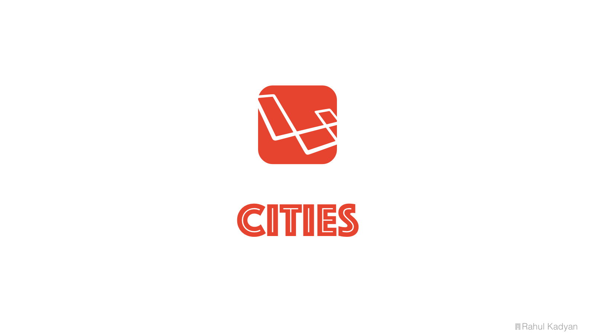

Cities
======
A cities list provider for [Laravel](https://laravel.com/).



<p align="center">
  <a href="https://styleci.io/repos/53937543">
    
  </a>
  <a href="https://circleci.com/gh/znck/cities">
    
  </a>
  <a href="https://coveralls.io/github/znck/cities?branch=master">
    
  </a>
  <a href="LICENSE">
    
  </a>
  <a href="https://packagist.org/packages/znck/cities">
    
  </a>
  <a href="https://github.com/znck/cities/releases">
    
  </a>

  <a href="https://github.com/znck/cities/issues">
    
  </a>
</p>

## Installation

Either [PHP](https://php.net) 7.0+ is required.

To get the latest version of cities, simply require the project using [Composer](https://getcomposer.org):

```bash
$ composer require znck/cities
```

Instead, you may of course manually update your require block and run `composer update` if you so choose:

```json
{
    "require": {
        "znck/cities": "^0.1.2"
    }
}
```

Once `Cities` is installed, you have to register its service provider. Open `config/app.php` and add `Znck\Cities\CitiesServiceProvider::class` to `providers` key. Your `config/app.php` should look like this.

```php
<?php return [
  // ...
  'providers' => [
    // ....
    Znck\Cities\CitiesServiceProvider::class,
  ]
  // ...
];
```

## Usage
- Use `City` trait in you [Eloquent](https://laravel.com/docs/master/eloquent) model.

```php
<?php namespace App;

use Illuminate\Database\Eloquent\Model;
use Znck\Cities\City as CityTrait;

class City extends Model {
  use CityTrait;
}
```

- Cities provides command (`php artisan cities:update`) to update list in database.

## Configuration
Table names for cities and states are required. By default `cities` and `states` are used, but you can override these.

To get started, you'll need to publish all vendor assets:

```
php artisan vendor:publish --provider='Znck\Cities\CitiesServiceProvider'
```

This will create a `config/cities.php` file in your app that you can modify to set your configuration. Also, make sure you check for changes to the original config file in this package between releases.

## Conventions
Expected schema:

```php
Schema::create('countries', function (Blueprint $table) {
    $table->increments('id');
    $table->string('name');
    $table->string('code', 2)->unique();
    $table->timestamps();
});

Schema::create('states', function (Blueprint $table) {
    $table->increments('id');
    $table->string('name');
    $table->string('code', 5)->unique();
    $table->unsignedInteger('country_id');
    $table->timestamps();

    $table->foreign('country_id')->references('id')->on('countries');
});

Schema::create('cities', function (Blueprint $table) {
    $table->increments('id');
    $table->string('name');
    $table->string('code', 10)->unique();
    $table->unsignedInteger('state_id');
    $table->timestamps();

    $table->foreign('state_id')->references('id')->on('states');
});

```

## License
Cities is licensed under [The MIT License (MIT)](LICENSE).
